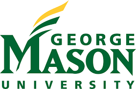

I am currently a Ph.D. student in the [Department of Computer Science and Engineering](https://cse.nd.edu/), 
[University of Notre Dame](https://www.nd.edu/), under the supervision of 
[Prof. Yiyu Shi](https://engineering.nd.edu/faculty/yiyu-shi/) at the University of Notre Dame. I also work closely with 
[Prof. Yongshan Ding](https://www.yongshanding.com/) at Yale University, 
[Prof. Weiwen Jiang](https://jqub.github.io/) at George Mason University, and 
[Prof. Tongyang Li](https://www.tongyangli.com/) at Peking University.

I received my Bachelor's degree from [University of Wisconsin, Madison](https://www.wisc.edu/) in Madison, WI, US, where I worked with 
[Professor Juda Shohet](https://directory.engr.wisc.edu/ece/Faculty/Shohet_J-/) in the Plasma Processing & Technology lab at UW-Madison.

<!-- Please check my [CV](CV_ZhidingLiang.pdf) for more details. -->

I will join Rensselaer Polytechnic Institute (RPI) as a Tenure Track Assistant Professor! I have fully funded PhD openings in my group for Spring/Fall 2025, if you are admitted to RPI at Fall 2024 and still in rotation, you can also feel free to contact with me!

# Research
My research interests recently focus on quantum computing, including:
- **Hardware Softerware Co-design for Quantum Computing From Gate level to Pulse level**
- **Efficient Quantum Error Mitigation and Benchmarking at Pulse level**

I am also interested in outreach and education in software and system level quantum computing. I am organizing the [Quantum Computer System Lecture Series (QuCS)](https://sites.nd.edu/quantum/). Additionally, I am leading the organization of the [2023 ACM/IEEE Quantum Computing for Drug Discovery Challenge](https://qccontest.github.io/QC-Contest/index.html) at the International Conference on Computer-Aided Design ([ICCAD 2023](https://iccad.com/index.php/)).

# Education

* **University of Notre Dame**. PhD student in Computer science and Engineering. 2021 - Now
* **University of Wisconsin, Madison**. B.S. in Electrical Engineering. 2018 - 2020
* **Auburn University**. Computer Engineering transfer to **UW-Madison**. 2016-2018

# Professional Experience

* **JPMorgan Chase&Co**. Research Technology Summer Associate - Quantum Computing. 2023 Summer
* **Silan Microelectronics**. Back-end Development Intern. 2018 Summer

# Honors and Awards
* Edison Innovation Fellowship   University of Notre Dame.
* 2023 ICCAD Student Scholar Program Grant.   ICCAD. 2023
* 2023 ISCA Student Travel Grant.   ISCA. 2023
* 2022 DAC Young Fellow with Travel Grant.   DAC. 2022
* 2021 DAC Young Fellow.   DAC. 2021
* [Certificate of Quantum Excellence (100/100)](https://jqub.github.io/2021/08/27/news_21_08_27-IBMQ/index.html).  IBM. 2021.
* Dean's List.   University of Wisconsin, Madison. 2018fall - 2020spring.
* Dean's List.   Auburn University. 2017spring - 2018spring.

# News

<ul>
    <li>Two papers accepted by <strong>DAC</strong>, Cheers! Feb. 2024</li>
    <li>One paper accepted by <strong>TCAD</strong>, Cheers! Jan. 2024</li>
    <li>One paper accepted by <strong>TVCG</strong>, Cheers! Dec. 2023</li>
    <li>My work PAN (also recognized as NAPA) (<a href="https://arxiv.org/abs/2208.01215">arxiv</a>) is highlighted by <a href="https://medium.com/qiskit/enhance-variational-quantum-algorithms-with-qiskit-pulse-and-qiskit-dynamics-768249daf8dd">IBM Qiskit</a>!</li>
    <li>I lead to organize the 2023 ACM/IEEE Contest for Machine Learning on Hardware at International Conference on Computer-Aided Design (ICCAD) -- Track 2: <a href="https://qccontest.github.io/QC-Contest/index.html">Quantum Computing for Drug Discovery Challenge</a>! Aug 22, 2023</li>
    <li>One paper is accepted by the 7th International Conference on Quantum Techinques in Machine Learning (QTML), Cheers! Aug. 2023</li>
    <li>I am honored to be selected as <strong>Edison Innovation Fellow</strong> at University of Notre Dame, Cheers! Aug.2023</li>
    <li>One paper accepted to Quantum Science and Engineering Education track of <strong>QCE23</strong>, Cheers! July.2023</li>
    <li>One paper accepted to <strong>DAC</strong>, Cheers! Feb.2023</li>
    <li>I will join <strong>JPMorgan Chase & Co</strong> as a Global Technologies Research Associate Intern in Quantum Computing Program during June 2023 - Augest 2023.</li>
    <li>I will join <strong>Yale Quantum Institute</strong> as a visiting scholar under supervised by <strong>Prof. Yongshan Ding</strong> during Feb 2023 - June 2023.</li>
    <li>One paper will appear on <strong>ICCAD</strong>, Cheers! Aug.2022</li>
    <li>One paper accepted to <strong>QCE</strong>, Cheers! June.2022</li>
    <li><strong>Zhiding</strong> and Hanrui have organized quantum computing systems lecture series, please check <a href="https://sites.nd.edu/quantum/">Our Website</a> sign up on the mail list and follow the update! Welcome to contact for giving a talk in our series!</li>
    <li><strong>Zhiding</strong> has been selected as a <strong>DAC Young Fellow</strong>, Cheers! Thanks for the travel grant from DAC! April.2022</li>
</ul>
<a href="javascript:void(0);" onclick="toggleNews()" id="read-more-btn">Read More</a>

    <ul>
        <li>Become a contributor to <a href="https://github.com/mit-han-lab/torchquantum">TorchQuantum</a> and aim to extend the functionality of support quantum pulse, thanks Hanrui! Feb.2022</li>
        <li><strong>Zhiding</strong> has been selected as a <strong>DAC Young Fellow</strong>, Cheers! Nov.2021</li>
        <li>Two papers will be published on <strong>ICCAD</strong>, Cheers! Sep.2021</li>
        <li><strong>Zhiding</strong> has joined University of Notre Dame as a PhD student in Computer Science and Engineering department under guidance of <strong>Prof. Yiyu Shi</strong>. July.2021</li>
    </ul>

# Publications

* **Zhiding Liang**, Zhixin Song, Jinglei Cheng, Hang Ren, Tianyi Hao, Rui Yang, Yiyu Shi and Tongyang Li, "SpacePulse: Combining Parameterized Pulses and Contextual Subspace for More Practical VQE". Accepted to the 61th IEEE/ACM Design Automation Conference([DAC 2024](https://arxiv.org/pdf/2311.17423.pdf)).
* **Zhiding Liang**, Gang Liu, Zheyuan Liu, Jinglei Cheng, Tianyi Hao, Kecheng Liu, Hang Ren, Zhixin Song, Ji Liu, Fanny Ye, Yiyu Shi, "Graph Machine Learning for Variational Quantum Algorithms". Accepted to the 61th IEEE/ACM Design Automation Conference([DAC 2024](https://arxiv.org/pdf/2311.17423.pdf)).
* **Zhiding Liang^**, Jinglei Cheng^, Hang Ren, Hanrui Wang, Fei Hua, Yongshan Ding, Fred Chong, Song Han, Xuehai Qian, Yiyu Shi, "NAPA: Intermediate-level Variational Native-pulse Ansatz for Variational Quantum Algorithms". Accepted to the IEEE Transactions on Computer-Aided Design of Integrated Circuits and Systems([TCAD](https://ieeexplore.ieee.org/xpl/RecentIssue.jsp?punumber=43)), This work also **highlighted** by **[IBM Qiskit](https://medium.com/qiskit/enhance-variational-quantum-algorithms-with-qiskit-pulse-and-qiskit-dynamics-768249daf8dd)**.
* **Zhiding Liang**, Hanrui Wang, "[QuCS: A Lecture Series on Quantum Computer Software and System](2309.15908.pdf)". Accepted to the IEEE International Conference on Quantum Computing and Engineering. ([QCE 2023](https://arxiv.org/pdf/2203.17267.pdf)) Quantum Science and Engineering Education (QSSEC23) track. 
* **Zhiding Liang**, Jinglei Cheng, Zhixin Song, Hang Ren, Rui Yang, Hanrui Wang, Kecheng Liu, Peter Kogge, Tongyang Li, Yongshan Ding, Yiyu Shi, "Towards Advantages of Parameterized Quantum Pulses". Accepted to the 7th International Conference on Quantum Techinques in Machine Learning([QTML 2023](https://arxiv.org/pdf/2304.09253.pdf)).
* **Zhiding Liang**, Zhixin Song, Jinglei Cheng, Zichang He, Ji Liu, Hanrui Wang, Ruiyang Qin, Yiru Wang, Song Han, Xuehai Qian, Yiyu Shi, "Hybrid Gate-Pulse Model for Variational Quantum Algorithms". Accepted to the 60th IEEE/ACM Design Automation Conference([DAC 2023](https://arxiv.org/pdf/2212.00661.pdf)).
* **Zhiding Liang^**, Hanrui Wang^, Jinglei Cheng, Yongshan Ding, Hang Ren, Zhengqi Gao, Duane Boning, Xuehai Qian, Song Han, Weiwen Jiang, Yiyu Shi, "Variational Quantum Pulse Learning". Accepted to the IEEE International Conference on Quantum Computing and Engineering. ([QCE 2022](https://arxiv.org/pdf/2203.17267.pdf)). 
* **Zhiding Liang**, Zhepeng Wang, Junhuan Yang, Lei Yang, Yiyu Shi, Weiwen Jiang, “Can Noise on Qubits Be Learned in Quantum Neural Network? A Case Study on QuantumFlow”. Published in the Proceedings of 40th International Conference On Computer-Aided Design ([ICCAD 2021](https://arxiv.org/pdf/2109.03430.pdf)).
* **Zhiding Liang**, “A comprehensive understanding of conductive mechanism of RRAM: from electron conduction to ionic dynamics". Published in the 2nd International Conference on Electrical Engineering and Control Technologies ([CEECT 2020](https://www.ceect.org/))
* Shaolun Ruan, **Zhiding Liang**, Qiang Guan, Paul Griffin, Xiaolin Wen, Yanna Lin, and Yong Wang, "VIOLET: Visual Analytics for Explainable Quantum Neural Networks". Published in the IEEE Transactions on Visualization and Computer Graphics. ([TVCG](https://ieeexplore.ieee.org/xpl/RecentIssue.jsp?punumber=2945))
* Jinglei Cheng, Hanrui Wang, **Zhiding Liang**, Yiyu Shi, Song Han, Xuehai Qian, "TopGen: Topology-Aware Bottom-Up Generator for Variational Quantum Circuits". Under Revision at IEEE Transcations on Quantum Engineering ([arxiv](https://arxiv.org/pdf/2210.08190.pdf))
* Ruiyang Qin, **Zhiding Liang**, Jinglei Cheng, Peter Kogge, Yiyu Shi, “Improving Quantum Classifier Performance in NISQ Computers by Voting Strategy from Ensemble Learning”. ([arxiv](https://arxiv.org/pdf/2210.01656.pdf))
* Hanrui Wang, Junyu Liu, Jinglei Cheng, **Zhiding Liang**, Jiaqi Gu, Zirui Li, Yongshan Ding, Weiwen Jiang, Yiyu Shi, Xuehai Qian, David Z. Pan, Frederic T. Chong, Song Han. “Graph Transformer for Quantum Circuit Reliability Prediction". Accepted to the Proceedings of the 41th International Conference On
Computer-Aided Design ([ICCAD 2022](https://qmlsys.mit.edu/wp-content/uploads/2022/09/ICCAD2022_Transformer.pdf)).
* Zhepeng Wang, **Zhiding Liang**, Shanglin Zhou, Caiwen Ding, Yiyu Shi, Weiwen Jiang, “Exploration of Quantum Neural Architecture by Mixing Quantum Neuron Designs". Published in the Proceedings of the 40th International Conference On
Computer-Aided Design ([ICCAD 2021](https://iccad.com/index.php/)).

# Selected Talks

* Parameterized Quantum Pulses for Variational Quantum Algorithms. Eitech, 2023
* Parameterized Quantum Pulses for Variational Quantum Algorithms. University of Michigan-Shanghai Jiao Tong University Joint Institute, 2023
* Parameterized Quantum Pulses and It’s Application, IEEE Quantum Week (QuantumWeek), 2023
* Parameterized Quantum Pulses for Variational Quantum Algorithms, MAIB by Society of Artificial Intelligence Research (SAIR), 2023
* TorchQuantum: A Fast Library for Parameterized Quantum Circuits, International Symposium on Computer Architecture (ISCA), 2023
* Hybrid Gate - Pulse Model for Variational Quantum Algorithm, Peking University, 2023
* Tutorial: TorchQuantum Case Study For Robust Quantum Circuits, International Conference On
Computer-Aided Design (ICCAD), 2022
* Tutorial on TorchQuantum: A Fast Library for Parameterized Quantum Circuits, IEEE Quantum Week (QuantumWeek), 2022
* QuCS: A Lecture Series on Quantum Computer Software and System, IEEE Quantum Week (QuantumWeek), 2022
* Scalable Design-Program-Compilation Optimizations for Quantum Algorithms, Design Automation Conference (DAC), 2022
* A Quantum Machine Learning Co-Design Framework Towards Quantum Advantage, International Conference On
Computer-Aided Design (ICCAD), 2021
* Tutorial of QuantumFlow, Embedded Systems Week (ESWEEK), 2021

# Activity and Service
* Organizer of [QuCS: Quantum Computer Systems Lecture Series](https://sites.nd.edu/quantum/)
* Journal Reviewer: [ACM Transactions on Quantum Computing](https://dl.acm.org/journal/tqc), [Science Partner Jounral Intelligent Computing](https://spj.science.org/journal/icomputing), [Quantum Information Processing](https://www.springer.com/journal/11128)
* Conference Reviewer:[DAC 2021, 2024](https://www.dac.com/), [ICLR 2024](https://iclr.cc/), [ICML 2024](https://icml.cc/Conferences/2024/Dates), [Neurips 2023](https://nips.cc/), [Quantum 22' (Workshop in ACM/IEEE SEC)](https://iwqc22.github.io/)
* PC Member: [QSEEC 2023](https://ed.quantum.ieee.org/qseec-23/)
* Teaching Assistant. Operating System. University of Notre Dame (Silicon Valley Campus). 2022Spring
* Teaching Assistant. System Programming. University of Notre Dame. 2021Fall
<!---Experience--->

# Collaborators
 

